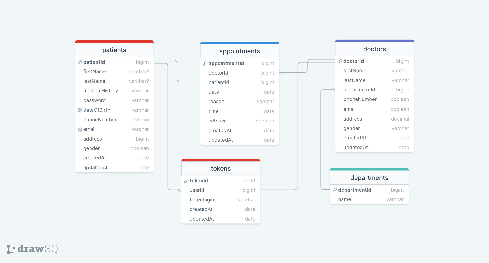

Doctor Appointment Application

This Doctor Appointment Application is designed to facilitate the scheduling and management of appointments between doctors and patients. The application includes features for user authentication, managing doctor and patient information, and scheduling appointments.

Features
>User authentication for doctors and patients.
>Doctors can manage their available time slots.
>Patients can schedule, view, and cancel appointments.
>Admin interface for managing doctors and patients.
>Secure password storage using hashing and salting.
>Responsive design for both desktop and mobile devices.

Technologies Used
>Frontend: React.js, Tailwind CSS
>Backend: Node.js, Express.js
>Database: MongoDB
>Authentication: JWT (JSON Web Tokens)
>Password Hashing: bcrypt

ERD Diagram:

"Introducing our comprehensive doctor appointment app, built with cutting-edge technologies like React.js, Redux, Node.js, Ant Design, and Express.js. 
